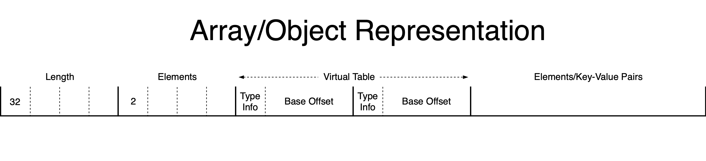
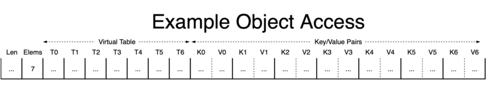
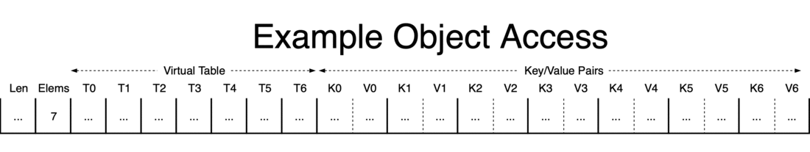

Dart Implementation
=====================

## Library Motivation
**Dart** originally grew out of a demand for high performance **MISD** stream
processing under the constraint that schema information could not be assumed
to be generally available.

**JSON** is, perhaps, the most convenient and human-readable interchange format
in widespread use, and lends itself very naturally to the idea of schema-less
stream processing, the only problem is that it's not, traditionally speaking,
a very good starting point for high performance code.

The fact that **JSON** is so easily readable means that it must be **parsed**
before a computer system can efficiently interact with it, and, while there is
an extremely rich set of high performance **JSON** parsers available in the wild,
nearly all of them generate a post-parsing representation that is only suitable
for interaction within the context of a single process, on a single machine.
The aforementioned architecture being targeted would be spread across _**many**_
co-operating processes potentially distributed across many machines/datacenters;
the concept of each machine/process individually parsing their input is a
non-starter for obvious reasons.

Of the few high performance **JSON** parsers available that generate a machine
representation suitable for network distribution
([sajson](https://github.com/chadaustin/sajson), [msgpack](https://msgpack.org),
[flexbuffers](https://github.com/google/flatbuffers), not many more), all were
discounted due to the fact that receiver-side performance degrades extremely
quickly as packet size increases ([source](benchmark/dart.png)).

## Library Design Goals
**Dart**, as a library, strives to provide an API/data representation that allows
for reasonably performant _dynamic_ interaction, and extremely high performance
_read-only_ interaction, requiring _**zero**_ allocations/parsing, and scaling
extremely well over a wide variety of packet sizes.

Additionally, the author of **Dart** believes that while high performance code
may take significant time/effort to _**develop**_, it shouldn't require significant
effort to _**use**_, and so **Dart** also strives to expose an API that is
extremely natural, expressive, and unopinionated, while also being easy to use,
and difficult to misuse, by default.

## On-the-Wire Representation/Implementation
So this is all well and good, but it begs the question "What, precisely, does
**Dart** do differently to scale more effectively with larger packet sizes?"

Well, astute, hypothetical, reader, how kind of you to pose such a timely
inquiry!

Implementation details obviously vary, but most libraries in this space organize
objects on the wire in a manner logically equivalent to the following:

Traditional hashtables depend on over-allocation/dynamic chaining to maintain their
celebrated O(1) lookup complexity, neither of which are feasible for a flat, on-the-wire,
representation, and so most dynamic serialization libraries (those that do not depend
on code generation/a fixed schema) emit a lexicographically sorted virtual (lookup)
table as part of their object layout, providing O(log(n)) lookup complexity backed
by binary search.

**Dart** is no different, however, it optimizes this base idea by sacrificing a bit
of on-the-wire representation size, and by observing the implied memory access pattern,
and its unfortunate implications for modern CPU caches.

## The Problem
Considering an object with 7 key-value pairs, most libraries will issue something like
the following pattern of memory accesses to find the requested key-value pair:

Lookup starts in the middle of the vtable, loads the offset of the key, then accesses
the character data embedded in the packet to check which direction to branch.
It continues bouncing back and forth between the vtable/packet data until it either
locates the necessary mapping or binary search terminates. The problem with this approach
is that, every time the CPU hits the packet data, it's thrashing across potentially hundreds
or thousands of bytes (depending on the size of the packet), and destroying the cache.

CPU caches tend to behave best when either the data being accessed is relatively small,
or the access pattern is very predictable, so that it can prefetch data proactively before
it's requested; our current access pattern guarantees neither of these properties, which
is why packets with large keyspaces tend to perform so poorly for most libraries.

## Dart's Solution
In contrast to the approach presented so far, **Dart** lays out objects in the following way:

**Dart** sacrifices a bit of representation size to cache some of the character data
(specifically, two bytes at the time this was written) for every key-value pair directly
in the vtable, allowing the lookup routine to confine itself to the vtable directly except
when _it has found a potential match_.

To state this more clearly, due to the layout of **Dart**'s vtable, key lookup only has
to exit the vtable (very small, definitely in cache), and touch the packet data
(probably not cached), _when the routine is likely already about to terminate_.

This gives us an access pattern closer to this:

The precise benefit of this optimization is obviously dependent on the distribution of the
first two characters present in the keyspace of the packet in question, but if your application
passes data with keys in English, based on real-world measurements over the past few years,
the optimization is likely to be _significant_.

## Conclusions
Research in this space will continue as feedback is provided by users from real-world use cases
(potentially exposing a Comparison policy or something similar for data that isn't well served by
lexicographical ordering), but based on the library author's own real world use cases, this solution
trades 4 bytes per key-value pair for a significant speedup in field lookups for non-trivial objects.
