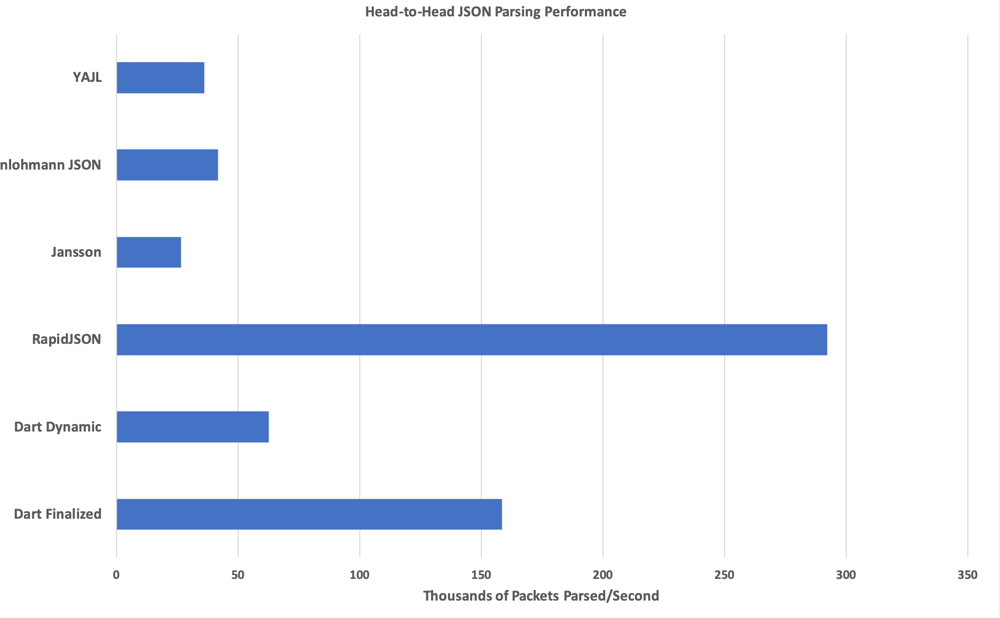

## Dart Parsing Performance
**TL;DR**:

**Dart** makes some parsing performance concessions to meet other design goals,
but the performance is still [quite good](#results).

**Long Version**:

As a library, **Dart**'s primary design goals are:
  1. Be the fastest way to represent `JSON` on the wire, requiring
     as little receiver-side effort as possible.
  2. Be easy to use (provide a consistent, natural, API).
  3. Be the fastest general purpose `JSON` parser.

In order to meet goal one, **Dart** requires that object keys be
_lexicographically sorted_ (no other library mentioned in this document depends on,
or preserves, this property) so that they can be efficiently queried when stored in a
flat (on-the-wire) representation.

In order to meet goal two, **Dart** preserves this ordering even in _dynamic_ mode,
where it's not strictly necessary, so that object iteration order _remains stable_
regardless of whether the object is _finalized_ or not.

Many other high performance `JSON` parsing libraries exist, but very few (if any) require
this property, which **does** have performance implications.

**Dart** does not support incremental parsing, must pass through an explicit sorting
step during _finalized_ parsing, and performs sorted insertion for _non-finalized_ objects.

Despite these restrictions, **Dart**'s parsing performance is quite good, running within
about 50% of [RapidJSON](https://github.com/Tencent/rapidjson), and will likely still
exceed that of `[insert library name here]`.

## Building Dart Head-to-Head Parsing Tests
**Dart** comes included with a parsing benchmark driver that depends on
[Google Benchmark](https://github.com/google/benchmark), which must be installed prior
to attempting to build the benchmark driver.
Assuming GBench has been installed:
```bash
# Clone it down.
git clone git@github.com:target/libdart.git
cd libdart/

# Create the cmake build directory and prepare a build
# of the benchmark driver without tests.
mkdir build
cd build
cmake .. -Dtest=OFF -Dbenchmark=ON

# Build the benchmark driver.
make

# Run the benchmark driver.
benchmark/configurable_bench
```
On my middle-end 2018 MacBook Pro, this outputs something like the following:
```
Christophers-MacBook-Pro-2:build christopherfretz$ benchmark/configurable_bench
2019-05-27 22:10:18
Running benchmark/configurable_bench
Run on (8 X 2300 MHz CPU s)
CPU Caches:
  L1 Data 32K (x4)
  L1 Instruction 32K (x4)
  L2 Unified 262K (x4)
  L3 Unified 6291K (x1)
------------------------------------------------------------------------------------------------------------------
Benchmark                                                           Time           CPU Iterations UserCounters...
------------------------------------------------------------------------------------------------------------------
benchmark_helper/dart_nontrivial_finalized_json_test            66174 ns      65695 ns      10191 parsed packets=152.219k/s
benchmark_helper/dart_nontrivial_dynamic_json_test             193853 ns     188846 ns       3968 parsed packets=52.9532k/s
benchmark_helper/dart_nontrivial_json_key_lookups                3744 ns       3727 ns     178209 parsed key lookups=26.8291M/s
benchmark_helper/rapidjson_nontrivial_insitu_json_test          37761 ns      37210 ns      19833 parsed packets=268.743k/s
benchmark_helper/rapidjson_nontrivial_json_test                 46986 ns      46631 ns      15345 parsed packets=214.449k/s
benchmark_helper/rapidjson_nontrivial_json_key_lookups           6750 ns       6556 ns     114471 parsed key lookups=15.2529M/s
benchmark_helper/sajson_nontrivial_json_test                    13362 ns      13272 ns      50082 parsed packets=753.442k/s
benchmark_helper/sajson_nontrivial_json_key_lookups              5413 ns       5291 ns     128480 parsed key lookups=18.8987M/s
benchmark_helper/nlohmann_json_nontrivial_json_test            267938 ns     262928 ns       2711 parsed packets=38.0333k/s
benchmark_helper/nlohmann_json_nontrivial_json_key_lookups       8518 ns       8428 ns      80203 parsed key lookups=11.8659M/s
benchmark_helper/yajl_nontrivial_json_test                     304592 ns     301546 ns       2353 parsed packets=33.1624k/s
benchmark_helper/yajl_nontrivial_json_key_lookups                8588 ns       8492 ns      81722 parsed key lookups=11.7763M/s
benchmark_helper/jansson_nontrivial_json_test                  381031 ns     378135 ns       1843 parsed packets=26.4456k/s
benchmark_helper/jansson_nontrivial_json_key_lookups             4595 ns       4549 ns     160465 parsed key lookups=21.9828M/s
```
The output from the previous command is generated by running each test case a
single time, which can produce somewhat noisy results, especially for the fastest
test cases.

Averaging this out across many independent runs gives more stable results, and
can be performed with the following command:
```
benchmark/configurable_bench --benchmark_repetitions={number of repetitions} --benchmark_report_aggregates_only=true
```

## Results
Using the file found at `benchmark/input.json` (which can be replaced with any
newline-separated json file to test your own data), averaged across 16 repetitions,
this produces the following results:

An initial takeaway from this is that [Chad Austin](https://github.com/chadaustin)
is a crazy wizard man who deserves another
[shoutout](https://chadaustin.me/2017/05/writing-a-really-really-fast-json-parser/).
If raw parsing performance, without regard for much else, is what you're looking for,
[SAJSON](https://github.com/chadaustin/sajson) will get you there.

If, however, you're looking for something a bit safer/easier to use, you need to
work with large objects, or you need network integration, it makes the graph a bit
easier to reason about:

