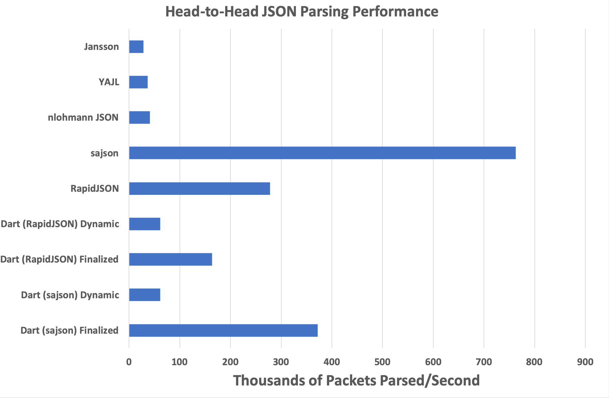
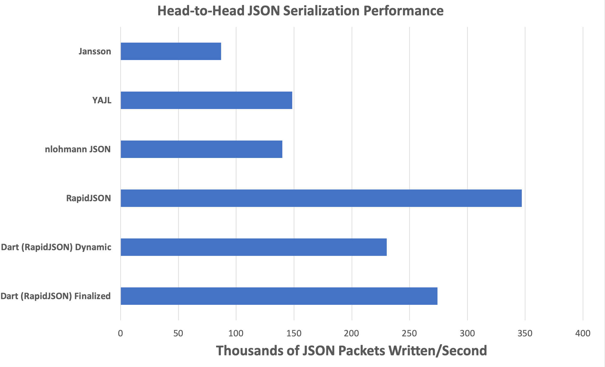

## Dart Parsing/Writing Performance
**TL;DR**:

**Dart** makes some parsing performance concessions to meet other design goals,
but the performance is still [quite good](#results).

**Long Version**:

As a library, **Dart**'s primary design goals are:
  1. Be the fastest way to represent **JSON** on the wire, requiring
     as little receiver-side effort as physically possible.
  2. Be easy to use (provide a consistent, natural, API).
  3. Be the fastest general purpose **JSON** parser.

In order to meet goal one, **Dart** requires that object keys be
_lexicographically sorted_ (no other library mentioned in this document depends on,
or preserves, this property) so that they can be efficiently queried when stored in a
flat (on-the-wire) representation.

In order to meet goal two, **Dart** preserves this ordering even in _dynamic_ mode,
where it's not strictly necessary, so that object iteration order _remains stable_
regardless of whether the object is _finalized_ or not.

Many other high performance **JSON** parsing libraries exist, but very few (if any) require
this property, which **does** have performance implications.

**Dart** does not support incremental parsing, must pass through an explicit sorting
step during _finalized_ parsing, and performs sorted insertion for _non-finalized_ objects.

Despite these restrictions, **Dart**'s parsing performance is quite good, running within
about 50% of [RapidJSON](https://github.com/Tencent/rapidjson), and will likely still
exceed that of `[insert library name here]`.

## Building Dart Head-to-Head Parsing/Writing Tests
**Dart** comes included with a parsing benchmark driver that depends on
[Google Benchmark](https://github.com/google/benchmark), which must be installed prior
to attempting to build the benchmark driver.
Assuming GBench has been installed:
```bash
# Clone it down.
git clone git@github.com:target/libdart.git
cd libdart/

# Create the cmake build directory and prepare a build
# of the benchmark driver without tests.
mkdir build
cd build
cmake .. -Dtest=OFF -Dbenchmark=ON

# Build the benchmark driver.
make

# Run the benchmark driver.
benchmark/configurable_bench
```
On my middle-end 2018 MacBook Pro, this outputs something like the following:
```
Christophers-MacBook-Pro-2:build christopherfretz$ benchmark/configurable_bench
2019-05-31 21:27:12
Running benchmark/configurable_bench
Run on (8 X 2300 MHz CPU s)
CPU Caches:
  L1 Data 32K (x4)
  L1 Instruction 32K (x4)
  L2 Unified 262K (x4)
  L3 Unified 6291K (x1)
-----------------------------------------------------------------------------------------------------------------------
Benchmark                                                                Time           CPU Iterations UserCounters...
-----------------------------------------------------------------------------------------------------------------------
benchmark_helper/dart_nontrivial_finalized_json_test                 27682 ns      27541 ns      24751 parsed packets=363.091k/s
benchmark_helper/dart_nontrivial_dynamic_json_test                  158967 ns     158222 ns       4301 parsed packets=63.2023k/s
benchmark_helper/dart_nontrivial_finalized_json_generation_test      36241 ns      36035 ns      18856 serialized packets=277.512k/s
benchmark_helper/dart_nontrivial_dynamic_json_generation_test        43105 ns      42901 ns      16268 serialized packets=233.092k/s
benchmark_helper/dart_nontrivial_json_key_lookups                     3803 ns       3785 ns     181578 parsed key lookups=26.4189M/s
benchmark_helper/rapidjson_nontrivial_insitu_json_test               34035 ns      33853 ns      20248 parsed packets=295.393k/s
benchmark_helper/rapidjson_nontrivial_json_test                      45588 ns      45391 ns      15351 parsed packets=220.309k/s
benchmark_helper/rapidjson_nontrivial_json_key_lookups                6180 ns       6147 ns     109022 parsed key lookups=16.2692M/s
benchmark_helper/rapidjson_nontrivial_json_generation_test           29602 ns      29463 ns      22819 serialized packets=339.413k/s
benchmark_helper/sajson_nontrivial_json_test                         14360 ns      14077 ns      51069 parsed packets=710.4k/s
benchmark_helper/sajson_nontrivial_json_key_lookups                   5122 ns       5086 ns     134450 parsed key lookups=19.6603M/s
benchmark_helper/nlohmann_json_nontrivial_json_test                 254695 ns     252819 ns       2802 parsed packets=39.5539k/s
benchmark_helper/nlohmann_json_nontrivial_json_key_lookups            8471 ns       8430 ns      78012 parsed key lookups=11.8618M/s
benchmark_helper/nlohmann_json_nontrivial_json_generation_test       68175 ns      67903 ns       9813 serialized packets=147.269k/s
benchmark_helper/yajl_nontrivial_json_test                          284750 ns     282558 ns       2480 parsed packets=35.391k/s
benchmark_helper/yajl_nontrivial_json_key_lookups                     7998 ns       7963 ns      83284 parsed key lookups=12.558M/s
benchmark_helper/yajl_nontrivial_json_generation_test                63868 ns      63497 ns      10480 serialized packets=157.488k/s
benchmark_helper/jansson_nontrivial_json_test                       359954 ns     358272 ns       1929 parsed packets=27.9118k/s
benchmark_helper/jansson_nontrivial_json_key_lookups                  4395 ns       4373 ns     159607 parsed key lookups=22.8688M/s
benchmark_helper/jansson_nontrivial_json_generation_test            110410 ns     109951 ns       6015 serialized packets=90.9496k/s
```
The output from the previous command is generated by running each test case a
single time, which can produce somewhat noisy results, especially for the fastest
test cases.

Averaging this out across many independent runs gives more stable results, and
can be performed with the following command:
```
benchmark/configurable_bench --benchmark_repetitions={number of repetitions} --benchmark_report_aggregates_only=true
```

## Results
Using the file found at `benchmark/input.json` (which can be replaced with any
newline-separated json file to test your own data), averaged across 16 repetitions,
this produces the following results:


An initial takeaway from this is that [Chad Austin](https://github.com/chadaustin)
is a crazy wizard man who deserves another
[shoutout](https://chadaustin.me/2017/05/writing-a-really-really-fast-json-parser/).
If raw parsing performance, above anything else, is what you're looking for,
[sajson](https://github.com/chadaustin/sajson) will get you there.

If, however, you're looking for something a bit safer/easier to use, you need to
work with large objects, or you need network integration, **Dart** can provide all
of this, while also providing best, or second-best, performance for all JSON needs.
