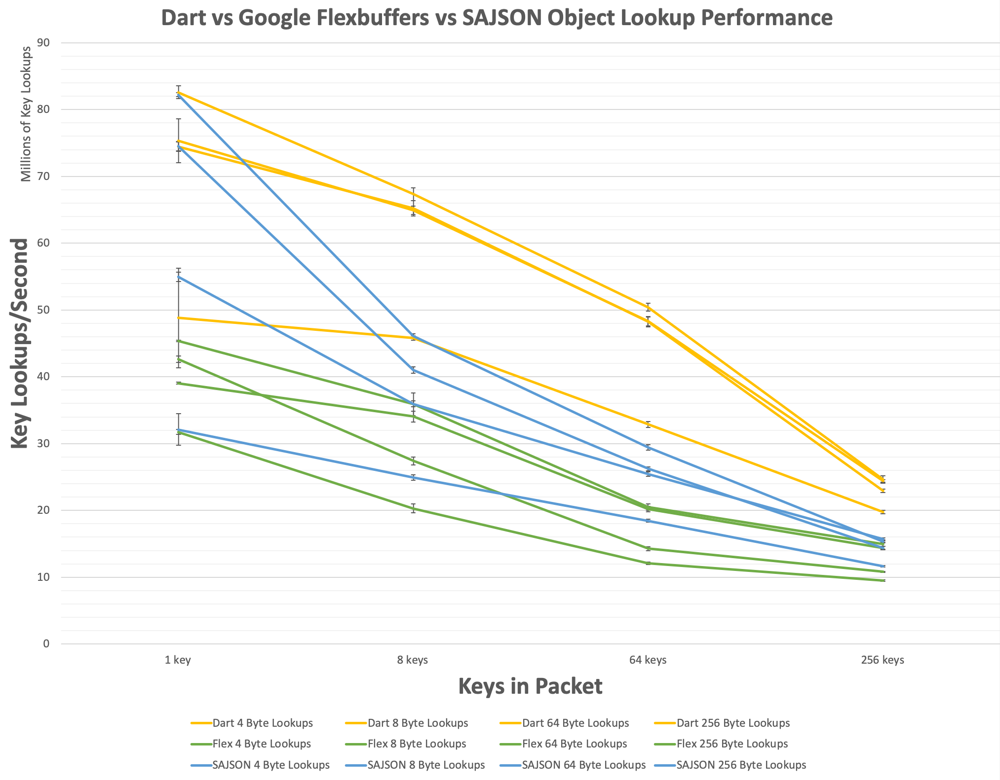
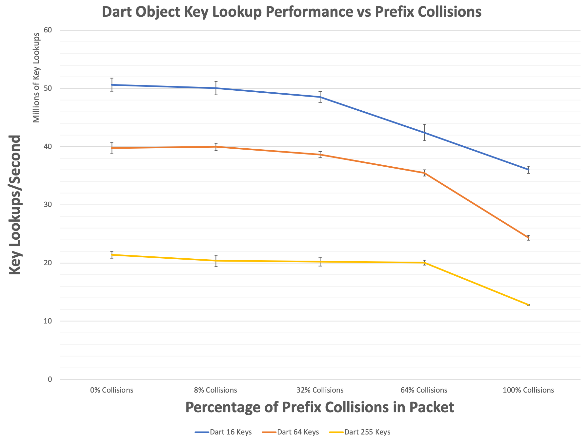

## Dart Performance

**TL;DR**:
Skip to the [results](#results).

**Long Version**:

As a library, **Dart** tries to walk a fine line between providing the
highest possible performance, while also enabling expressive usability
across a wide variety of domains.

As mentioned in the [readme](README.md#explicit-api-lifecycle), **Dart**
publicly exposes several different classes for interacting with its API
at various levels of abstraction and peformance: `dart::packet`,
`dart::heap`, and `dart::buffer`.

Additionally, as mentioned in the [expert usage](ADVANCED.md) document,
**Dart** exposes a variety of customization points to modify the reference
counter implementation used by the library.

## Performance Characteristics of Dart Types
`dart::packet` is the most flexible of the aforementioned classes, erasing
implementation details related to type, mutability, and layout, and
providing a uniform, and reasonably performant, API for all use-cases.
For the basic case of using **Dart** as a dead-simple **JSON**/**YAML**
parser, this is likely to be the class you want.
This flexibility is not without cost, however, and `dart::packet` should
typically be assumed to be the slowest of the types exported by the
**Dart** library.

`dart::heap` is used to represent a dynamic tree of objects, trading
performance for mutability, and is intended for use-cases where mutation
is mandatory and common. It implements a nearly identical API compared
with `dart::packet`, but will be marginally faster in all cases where
`dart::packet::is_finalized` returns false.

`dart::buffer` is the highest performance class exposed by the library,
and is used to enable read-only interaction with an arbitrary object tree
with the least overhead possible. Exposing a subset of the `dart::packet`
API, a `dart::buffer` instance is guaranteed to _**never**_ allocate
memory in any member function (with the exception of functions that return
STL containers and conversion operators to other **Dart** types), and
is guaranteed to be stored contiguously as a flattened buffer of bytes
(accessible via `dart::buffer::get_bytes` or `dart::buffer::dup_bytes`)
immediately ready for distribution over a socket/file/shared memory queue/etc.

Read-only view types, like `dart::packet::view`, `dart::heap::view`,
and `dart::buffer::view`, will perform largely similarly to their traditional
counterparts, however, they do not participate in reference counting, and
so can be used to selectively disable reference counting and its associated
cost within a particular scope.

## Measuring Dart Performance
Given the API topology mentioned above, all performance validation cases
for **Dart** first consider whether the operation being tested requires
mutation (in which case `dart::heap` is used) or not (in which case
`dart::buffer` is used).

Additionally, all **Dart** performance test cases override the default
reference counter implementation, replacing it with `dart::unsafe_ptr`,
which implements thread-_unsafe_ reference counting.

## Building Dart Performance Tests
The included benchmark driver depends on
[Google Benchmark](https://github.com/google/benchmark), which must be
installed prior to attempting to build the benchmark driver.
Assuming GBench has been installed:
```bash
# Clone it down.
git clone git@github.com:target/libdart.git
cd libdart/

# Create the cmake build directory and prepare a build
# of the benchmark driver without tests.
mkdir build
cd build
cmake .. -Dtest=OFF -Dbenchmark=ON

# Build the benchmark driver.
make

# Run the benchmark driver.
benchmark/static_bench
```
On my middle-end 2018 MacBook Pro, this outputs something like the following:
```
Christophers-MacBook-Pro-2:build christopherfretz$ benchmark/static_bench
2019-05-31 21:39:52
Running benchmark/static_bench
Run on (8 X 2300 MHz CPU s)
CPU Caches:
  L1 Data 32K (x4)
  L1 Instruction 32K (x4)
  L2 Unified 262K (x4)
  L3 Unified 6291K (x1)
--------------------------------------------------------------------------------------------------------------------------
Benchmark                                                                   Time           CPU Iterations UserCounters...
--------------------------------------------------------------------------------------------------------------------------
benchmark_helper/parse_dynamic_flat_packet                               5288 ns       5283 ns     123442 parsed flat packets=189.277k/s
benchmark_helper/parse_dynamic_nested_packet                             4227 ns       4224 ns     160740 parsed nested packets=236.735k/s
benchmark_helper/parse_finalized_flat_packet                             1269 ns       1267 ns     563407 parsed flat packets=789.246k/s
benchmark_helper/parse_finalized_nested_packet                            862 ns        861 ns     811538 parsed nested packets=1.16096M/s
benchmark_helper/lookup_finalized_fields                                  283 ns        282 ns    2352403 finalized field lookups=53.0977M/s
benchmark_helper/lookup_finalized_random_fields/1/4                        12 ns         12 ns   58298354 finalized random field lookups=85.9067M/s
benchmark_helper/lookup_finalized_random_fields/8/4                       120 ns        120 ns    5682602 finalized random field lookups=66.6887M/s
benchmark_helper/lookup_finalized_random_fields/64/4                     1514 ns       1514 ns     459363 finalized random field lookups=42.2734M/s
benchmark_helper/lookup_finalized_random_fields/255/4                   11352 ns      11348 ns      58587 finalized random field lookups=22.4716M/s
benchmark_helper/lookup_finalized_random_fields/1/8                        13 ns         13 ns   52637120 finalized random field lookups=77.1276M/s
benchmark_helper/lookup_finalized_random_fields/8/8                       126 ns        126 ns    5404905 finalized random field lookups=63.5029M/s
benchmark_helper/lookup_finalized_random_fields/64/8                     1497 ns       1496 ns     453124 finalized random field lookups=42.7803M/s
benchmark_helper/lookup_finalized_random_fields/255/8                   12003 ns      11999 ns      56178 finalized random field lookups=21.2524M/s
benchmark_helper/lookup_finalized_random_fields/1/64                       13 ns         13 ns   47897308 finalized random field lookups=77.9549M/s
benchmark_helper/lookup_finalized_random_fields/8/64                      128 ns        128 ns    5421314 finalized random field lookups=62.401M/s
benchmark_helper/lookup_finalized_random_fields/64/64                    1591 ns       1590 ns     455907 finalized random field lookups=40.254M/s
benchmark_helper/lookup_finalized_random_fields/255/64                  11668 ns      11664 ns      58473 finalized random field lookups=21.8621M/s
benchmark_helper/lookup_finalized_random_fields/1/255                      18 ns         18 ns   37495715 finalized random field lookups=54.0791M/s
benchmark_helper/lookup_finalized_random_fields/8/255                     178 ns        178 ns    3840709 finalized random field lookups=44.9836M/s
benchmark_helper/lookup_finalized_random_fields/64/255                   2033 ns       2031 ns     347193 finalized random field lookups=31.5121M/s
benchmark_helper/lookup_finalized_random_fields/255/255                 13671 ns      13661 ns      50616 finalized random field lookups=18.6663M/s
benchmark_helper/lookup_finalized_colliding_fields/0/16/8                 295 ns        295 ns    2333917 field collisions=0 finalized random field lookups=54.2013M/s
benchmark_helper/lookup_finalized_colliding_fields/8/16/8                 309 ns        308 ns    2289460 field collisions=2 finalized random field lookups=51.9721M/s
benchmark_helper/lookup_finalized_colliding_fields/32/16/8                321 ns        321 ns    2196912 field collisions=6 finalized random field lookups=49.8924M/s
benchmark_helper/lookup_finalized_colliding_fields/64/16/8                353 ns        353 ns    1993558 field collisions=11 finalized random field lookups=45.3854M/s
benchmark_helper/lookup_finalized_colliding_fields/100/16/8               425 ns        425 ns    1632592 field collisions=16 finalized random field lookups=37.6832M/s
benchmark_helper/lookup_finalized_colliding_fields/0/64/8                1607 ns       1606 ns     437823 field collisions=0 finalized random field lookups=39.8448M/s
benchmark_helper/lookup_finalized_colliding_fields/8/64/8                1561 ns       1560 ns     427951 field collisions=6 finalized random field lookups=41.0193M/s
benchmark_helper/lookup_finalized_colliding_fields/32/64/8               1605 ns       1604 ns     419287 field collisions=21 finalized random field lookups=39.8918M/s
benchmark_helper/lookup_finalized_colliding_fields/64/64/8               1774 ns       1773 ns     381027 field collisions=41 finalized random field lookups=36.1053M/s
benchmark_helper/lookup_finalized_colliding_fields/100/64/8              2611 ns       2609 ns     254500 field collisions=64 finalized random field lookups=24.5283M/s
benchmark_helper/lookup_finalized_colliding_fields/0/255/8              11729 ns      11725 ns      59201 field collisions=0 finalized random field lookups=21.7487M/s
benchmark_helper/lookup_finalized_colliding_fields/8/255/8              11746 ns      11738 ns      59431 field collisions=21 finalized random field lookups=21.7237M/s
benchmark_helper/lookup_finalized_colliding_fields/32/255/8             11703 ns      11696 ns      57811 field collisions=82 finalized random field lookups=21.8019M/s
benchmark_helper/lookup_finalized_colliding_fields/64/255/8             12263 ns      12254 ns      55552 field collisions=164 finalized random field lookups=20.8092M/s
benchmark_helper/lookup_finalized_colliding_fields/100/255/8            19661 ns      19656 ns      35636 field collisions=255 finalized random field lookups=12.9728M/s
benchmark_helper/lookup_dynamic_fields                                    656 ns        656 ns    1030989 dynamic field lookups=22.8761M/s
benchmark_helper/lookup_dynamic_random_fields/1/4                          24 ns         24 ns   27774141 dynamic random field lookups=41.1583M/s
benchmark_helper/lookup_dynamic_random_fields/8/4                         324 ns        324 ns    2293721 dynamic random field lookups=24.7168M/s
benchmark_helper/lookup_dynamic_random_fields/64/4                       4396 ns       4393 ns     155065 dynamic random field lookups=14.5674M/s
benchmark_helper/lookup_dynamic_random_fields/256/4                     23111 ns      23106 ns      29804 dynamic random field lookups=11.0794M/s
benchmark_helper/lookup_dynamic_random_fields/1/8                          26 ns         26 ns   26613642 dynamic random field lookups=38.3973M/s
benchmark_helper/lookup_dynamic_random_fields/8/8                         362 ns        362 ns    1879351 dynamic random field lookups=22.1236M/s
benchmark_helper/lookup_dynamic_random_fields/64/8                       4750 ns       4749 ns     151556 dynamic random field lookups=13.4759M/s
benchmark_helper/lookup_dynamic_random_fields/256/8                     23854 ns      23836 ns      28989 dynamic random field lookups=10.74M/s
benchmark_helper/lookup_dynamic_random_fields/1/64                         35 ns         35 ns   20035721 dynamic random field lookups=28.9778M/s
benchmark_helper/lookup_dynamic_random_fields/8/64                        402 ns        402 ns    1680446 dynamic random field lookups=19.9111M/s
benchmark_helper/lookup_dynamic_random_fields/64/64                      5889 ns       5886 ns     118773 dynamic random field lookups=10.8733M/s
benchmark_helper/lookup_dynamic_random_fields/256/64                    28774 ns      28767 ns      23090 dynamic random field lookups=8.89899M/s
benchmark_helper/lookup_dynamic_random_fields/1/256                        46 ns         46 ns   12307909 dynamic random field lookups=21.691M/s
benchmark_helper/lookup_dynamic_random_fields/8/256                       562 ns        562 ns    1132906 dynamic random field lookups=14.2435M/s
benchmark_helper/lookup_dynamic_random_fields/64/256                     6843 ns       6808 ns     100915 dynamic random field lookups=9.40011M/s
benchmark_helper/lookup_dynamic_random_fields/256/256                   34902 ns      34859 ns      19401 dynamic random field lookups=7.34394M/s
benchmark_helper/iterate_finalized_random_fields/1                          7 ns          7 ns   99726465 finalized random field iterations=146.248M/s
benchmark_helper/iterate_finalized_random_fields/8                         29 ns         29 ns   24160926 finalized random field iterations=279.428M/s
benchmark_helper/iterate_finalized_random_fields/64                       203 ns        203 ns    3441427 finalized random field iterations=315.674M/s
benchmark_helper/iterate_finalized_random_fields/256                      796 ns        796 ns     861835 finalized random field iterations=321.626M/s
benchmark_helper/iterate_finalized_random_elements/1                        7 ns          7 ns  100193230 finalized random element iterations=143.839M/s
benchmark_helper/iterate_finalized_random_elements/8                       28 ns         28 ns   24388714 finalized random element iterations=284.067M/s
benchmark_helper/iterate_finalized_random_elements/64                     196 ns        196 ns    3564391 finalized random element iterations=326.263M/s
benchmark_helper/iterate_finalized_random_elements/256                    768 ns        768 ns     902481 finalized random element iterations=333.5M/s
benchmark_helper/iterate_dynamic_random_fields/1                           15 ns         15 ns   45526086 dynamic random field iterations=66.2366M/s
benchmark_helper/iterate_dynamic_random_fields/8                           86 ns         86 ns    7976572 dynamic random field iterations=93.0147M/s
benchmark_helper/iterate_dynamic_random_fields/64                         720 ns        720 ns     964055 dynamic random field iterations=88.9275M/s
benchmark_helper/iterate_dynamic_random_fields/256                       3027 ns       3026 ns     226564 dynamic random field iterations=84.5876M/s
benchmark_helper/iterate_dynamic_random_elements/1                         15 ns         15 ns   46087804 dynamic random element iterations=66.3875M/s
benchmark_helper/iterate_dynamic_random_elements/8                         90 ns         90 ns    7727293 dynamic random element iterations=88.994M/s
benchmark_helper/iterate_dynamic_random_elements/64                       611 ns        611 ns    1088901 dynamic random element iterations=104.717M/s
benchmark_helper/iterate_dynamic_random_elements/256                     2414 ns       2413 ns     286354 dynamic random element iterations=106.111M/s
benchmark_helper/access_sequential_finalized_strings                      213 ns        213 ns    3236246 finalized sequential element accesses=300.953M/s
benchmark_helper/access_sequential_dynamic_strings                        429 ns        428 ns    1622733 dynamic sequential element accesses=149.577M/s
benchmark_helper/access_random_finalized_strings                         3353 ns       3352 ns     203265 finalized random element accesses=305.461M/s
benchmark_helper/access_random_dynamic_strings                           7041 ns       7037 ns      99388 finalized random element accesses=145.507M/s
benchmark_helper/insert_into_exclusive_dynamic_object                     205 ns        205 ns    3236530 exclusive dynamic object field modifications=4.87787M/s
benchmark_helper/insert_into_exclusive_dynamic_array                       32 ns         32 ns   21742777 exclusive dynamic array element modifications=30.9806M/s
benchmark_helper/insert_into_shared_dynamic_object                       1463 ns       1463 ns     452027 shared dynamic object field modifications=683.745k/s
benchmark_helper/insert_into_shared_dynamic_array                         464 ns        464 ns    1516586 shared dynamic array element modifications=2.15473M/s
benchmark_helper/finalize_dynamic_packet                                 1063 ns       1063 ns     646227 finalized packets=941.047k/s
benchmark_helper/serialize_finalized_packet_into_json                    2050 ns       2049 ns     329831 serialized finalized packets=487.96k/s
benchmark_helper/serialize_finalized_nested_packet_into_json             1415 ns       1414 ns     512449 serialized finalized packets=707.005k/s
benchmark_helper/serialize_dynamic_packet_into_json                      2407 ns       2406 ns     287049 serialized dynamic packets=415.687k/s
benchmark_helper/serialize_dynamic_nested_packet_into_json               1530 ns       1529 ns     434642 serialized dynamic nested packets=653.831k/s
benchmark_helper/unwrap_finalized_string                                 2245 ns       2245 ns     304478 finalized string value accesses=456.18M/s
benchmark_helper/unwrap_dynamic_string                                    844 ns        843 ns     819413 dynamic string value accesses=1.21479G/s
benchmark_helper/unwrap_finalized_integer                                 868 ns        868 ns     757305 finalized integer value accesses=1.18G/s
benchmark_helper/unwrap_dynamic_integer                                   417 ns        417 ns    1656464 dynamic integer value accesses=2.45855G/s
benchmark_helper/unwrap_finalized_decimal                                 866 ns        865 ns     787924 finalized decimal value accesses=1.18447G/s
benchmark_helper/unwrap_dynamic_decimal                                   557 ns        556 ns    1245928 dynamic decimal value accesses=1.84035G/s
benchmark_helper/unwrap_finalized_boolean                                 903 ns        902 ns     746953 finalized boolean value accesses=1.13476G/s
benchmark_helper/unwrap_dynamic_boolean                                   580 ns        579 ns    1170021 dynamic boolean value accesses=1.76722G/s
```
The output from the previous command is generated by running each test case a
single time, which can produce somewhat noisy results, especially for the fastest
test cases.

Averaging this out across many independent runs gives more stable results, and
can be performed with the following command:
```
benchmark/static_bench --benchmark_repetitions={number of repetitions} --benchmark_report_aggregates_only=true
```

This will produce output for the mean test case performance, along with its
standard deviation, which is what was used to produce the graph on the main page
(16 repetitions in that particular case).

## Head-to-Head Performance Comparisons
The graph on the main page plots **Dart** performance
vs [sajson](https://github.com/chadaustin/sajson)
vs [Google Flexbuffers](https://github.com/google/flatbuffers)
and if those libraries are installed when building the benchmark driver, it will
automatically output an apples-to-apples comparison of similar operations with
those libraries.

## Understanding Benchmark Output
As you can see, **Dart** measures performance across a wide-variety of categories,
descriptions of those categories are listed below.

### Parse Flat/Nested Dynamic Packet
These benchmark cases are testing the whole stack of dynamic **Dart** **JSON** parsing,
from a `std::string`, parsed by the **RapidJSON** SAX parser, raised into a dynamic
`dart::heap` representation.

The distinction between the **nested** and **flat** test cases are precisely what
their names would suggest: the **flat** test case exists all at one level, whereas
the **nested** test benchmarks the additional overhead from creating nested objects.

### Parse Flat/Nested Finalized Packet
These benchmark cases are testing the whole stack of finalized **Dart** **JSON** parsing,
from a `std::string`, parsed by the **RapidJSON** DOM parser, lowered into a finalized,
contiguous, `dart::buffer` representation.

### Lookup Finalized Random Fields
This is a family of benchmark cases that test the performance of key-lookups on
a finalized packet (using `dart::buffer`).

The test cases are generated from the following parameter matrix:

| Number of Keys in Packet | Number of Characters per Key |
|:------------------------:|:----------------------------:|
|             1            |               4              |
|             8            |               4              |
|            64            |               4              |
|           256            |               4              |
|             1            |               8              |
|             8            |               8              |
|            64            |               8              |
|           256            |               8              |
|             1            |              64              |
|             8            |              64              |
|            64            |              64              |
|           256            |              64              |
|             1            |             256              |
|             8            |             256              |
|            64            |             256              |
|           256            |             256              |

This is considered to be the most important test-case from a performance perspective,
and is performed by generating a random set of keys of the specified size and length,
generating a finalized **Dart** object that contains all of those keys, and then
iterating over the set of keys and looking them up in the packet that was just
generated.

Each separate _repetition_ of each test case performed operates on an
_independently generated_ set of random keys.

### Lookup Finalized Colliding Fields
This is a family of benchmark cases that test the performance of key-lookups when
the keyspace of the packet being tested is intentionally filled with prefix collisions
(uses `dart::buffer`).

The test cases are generated from the following parameter matrix:

| Percentage of Collisions in Packet | Number of Keys in Packet | Number of Characters per Key |
|:----------------------------------:|:------------------------:|:----------------------------:|
|                 0                  |            16            |               8              |
|                 8                  |            16            |               8              |
|                32                  |            16            |               8              |
|                64                  |            16            |               8              |
|               100                  |            16            |               8              |
|                 0                  |            64            |               8              |
|                 8                  |            64            |               8              |
|                32                  |            64            |               8              |
|                64                  |            64            |               8              |
|               100                  |            64            |               8              |
|                 0                  |           256            |               8              |
|                 8                  |           256            |               8              |
|                32                  |           256            |               8              |
|                64                  |           256            |               8              |
|               100                  |           256            |               8              |

This is considered to be the second most important test-case from a performance perspective,
and serves to validate the real-world applicability of **Dart**'s prefix optimizations.

It is performed by first generating a random set of keys that _do not_ have any collisions
in their prefix bytes (best case scenario for **Dart**), and then intentionally inserting
additional, randomly colliding, keys until the requested collision percentage is reached
(will always generate _at least_ the percentage requested, may actually generate a higher
percentage depending on the total number of keys requested).

Each separate _repetition_ of each test case performed operates on an
_independently generated_ set of randomly colliding keys.

### Lookup Dynamic Random Fields
This is a family of benchmark cases that test the performance of key-lookups on
a dynamic packet (using `dart::heap`).

This benchmark case is identical to the previous benchmark from a methodological
perspective, the crucial difference being that this test measures the performance
of dynamic key lookups instead of finalized key lookups.

### Iterate over Random, Finalized, Fields
This is a family of benchmark cases that test the peformance of finalized object
iteration, iterating over a set of randomly generated strings.

The test cases are generated from the following parameter matrix:

| Number of Fields in Packet |
|:--------------------------:|
|             1              |
|             8              |
|            64              |
|           256              |

Each separate _repetition_ of each test case performed operates on an
_independently generated_ set of random fields.

### Iterate over Random, Dynamic, Fields
This is a family of benchmark cases that test the peformance of dynamic object
iteration, iterating over a set of randomly generated strings.

The test cases are generated from the following parameter matrix:

| Number of Fields in Packet |
|:--------------------------:|
|             1              |
|             8              |
|            64              |
|           256              |

Each separate _repetition_ of each test case performed operates on an
_independently generated_ set of random fields.

### Sequentially Access Finalized Strings
This benchmark case measures the performance of sequentially pulling strings
out of a finalized array (`dart::buffer`).

This benchmark is intended to benchmark the performance of array lookup, and
simply iterates from 0 -> [array size] and loads a value for each index.

### Sequentially Access Dynamic Strings
This benchmark case measures the performance of sequentially pulling strings
out of a dynamic array (`dart::heap`).

This benchmark is intended to benchmark the performance of array lookup, and
simply iterates from 0 -> [array size] and loads a value for each index.

### Randomly Access Finalized Strings
This benchmark case measures the performance of randomly pulling strings
out of a finalized array (`dart::buffer`).

This benchmark is intended to benchmark the performance of randomized array lookup,
and generates a set of random indices and loads a value for each index.

### Randomly Access Dynamic Strings
This benchmark case measures the performance of randomly pulling strings
out of a dynamic array (`dart::heap`).

This benchmark is intended to benchmark the performance of randomized array lookup,
and generates a set of random indices and loads a value for each index.

### Insertions into an Exclusive Dynamic Object
This benchmark case measures the cost of inserting a new key-value pair into a
dynamic object (`dart::heap`) _that is not shared_.

**Dart** uses a copy-on-write strategy to allow frictionless mutation of shared
data in a multi-threaded environment, and so the relative cost of inserting
something into a packet changes if the associated packet state is shared across
multiple instances.

### Insertions into an Exclusive Dynamic Array
This benchmark case measures the cost of pushing a new element onto the end of a
dynamic array (`dart::heap`) _that is not shared_.

**Dart** uses a copy-on-write strategy to allow frictionless mutation of shared
data in a multi-threaded environment, and so the relative cost of inserting
something into a packet changes if the associated packet state is shared across
multiple instances.

### Insertions into a Shared Dynamic Object
This benchmark case measures the cost of inserting a new key-value pair into a
dynamic object (`dart::heap`) _that is shared_.

This benchmark case is identical to the previous benchmark from a methodological
perspective, the crucial difference being that this test measures the performance
of dynamic key-value pair insertions into an object that shares its representation
across multiple packet instances, and therefore must perform a shallow copy-out
before performing the insertion.

### Insertions into a Shared Dynamic Array
This benchmark case measures the cost of pushing a new element onto the end of a
dynamic array (`dart::heap`) _that is shared_.

This benchmark case is identical to the previous benchmark from a methodological
perspective, the crucial difference being that this test measures the performance
of dynamic key-value pair insertions into an object that shares its representation
across multiple packet instances, and therefore must perform a shallow copy-out
before performing the insertion.

### Finalize a Dynamic Packet
This benchmark case measures the cost of *finalizing* a dynamic packet
(the cost of casting a `dart::heap` into a `dart::buffer`).

This operation consists of recursively climbing through the dynamic representation
once to calculate an upper bound on the required size of the contiguous buffer,
performing a single allocation of the calculated size, and then recursively walking
across the dynamic representation a second time and lowering it into the allocated buffer.

### Serialize Flat/Nested Finalized Packet
These benchmark cases are testing the whole stack of **Dart** **JSON** generation,
from a finalized representation (`dart::buffer`), fed into a **RapidJSON** writer,
and output as a `std::string`.

The distinction between the **nested** and **flat** test cases are precisely what
their names would suggest: the **flat** test case exists all at one level, whereas
the **nested** test benchmarks the additional overhead of nested objects.

### Serialize Flat/Nested Dynamic Packet
These benchmark cases are testing the whole stack of **Dart** **JSON** generation,
from a dynamic representation (`dart::heap`), fed into a **RapidJSON** writer,
and output as a `std::string`.

This benchmark is identical to the previous benchmark from a methodological
perspective, the crucial difference being that this test measures the performance
of serializing a _dynamic_ packet into **JSON**.

### Unwrap Finalized String
This benchmark case measurements the cost of unwrapping a finalized **Dart** string
object (`dart::buffer::string`) to an underlying machine type.

### Unwrap Dynamic String
This benchmark case measurements the cost of unwrapping a dynamic **Dart** string
object (`dart::heap::string`) to an underlying machine type.

### Unwrap Finalized Integer
This benchmark case measurements the cost of unwrapping a finalized **Dart** integer
object (`dart::buffer::number`) to an underlying machine type.

### Unwrap Dynamic Integer
This benchmark case measurements the cost of unwrapping a dynamic **Dart** integer
object (`dart::heap::number`) to an underlying machine type.

### Unwrap Finalized Decimal
This benchmark case measurements the cost of unwrapping a finalized **Dart** decimal
object (`dart::buffer::number`) to an underlying machine type.

### Unwrap Dynamic Decimal
This benchmark case measurements the cost of unwrapping a dynamic **Dart** decimal
object (`dart::heap::number`) to an underlying machine type.

### Unwrap Finalized Boolean
This benchmark case measurements the cost of unwrapping a finalized **Dart** boolean
object (`dart::buffer::flag`) to an underlying machine type.

### Unwrap Dynamic Boolean
This benchmark case measurements the cost of unwrapping a dynamic **Dart** boolean
object (`dart::heap::flag`) to an underlying machine type.

## Results
The resulting curves for some of the benchmark cases are included below.
These graphs were generated with 16 repetitions, outputting to csv, and using the
standard deviation of each test case as its error.

### Lookup Finalized Random Fields

The purpose of this graph is to plot **Dart** key lookup performance against that
of similar libraries, to measure the benefit for its prefix optimizations.

### Lookup Finalized Colliding Fields

The purpose of this graph is to validate the usefulness of **Dart**'s prefix
optimizations with less than ideal (collision heavy) data.
